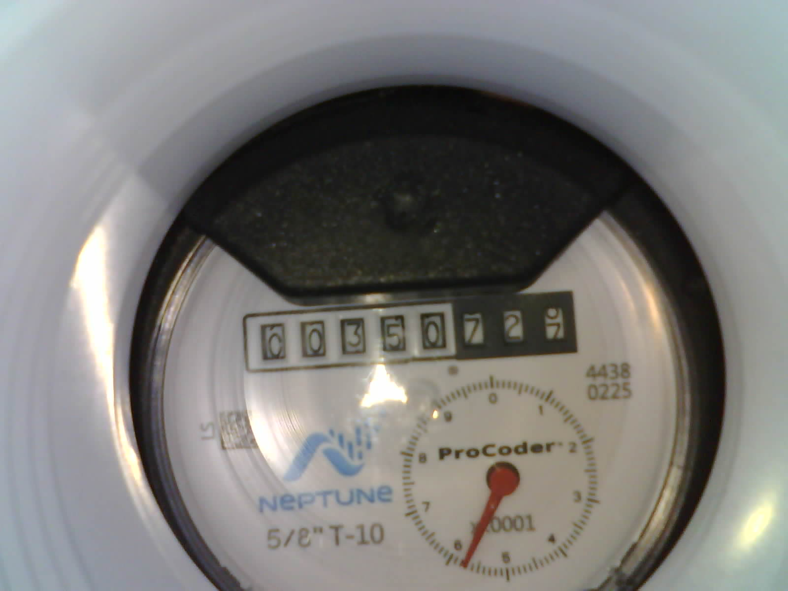

# WaterMeterModel

A comprehensive Python project for water meter digit recognition and analysis using machine learning and OCR technologies.

## Purpose

This project provides tools for:
- Training a Convolutional Neural Network (CNN) to recognize digits displayed on water meters
- Extracting text from water meter images using Optical Character Recognition (OCR)
- Automatically organizing meter reading images into categorized folders
- Analyzing water usage patterns through meter data

## Features

- **CNN-based Digit Recognition**: Train and deploy a deep learning model to classify water meter digits (0-9)
- **OCR Text Extraction**: Use EasyOCR to extract text from meter images
- **Automated Image Organization**: Automatically sort images into folders based on recognized digits
- **Model Export**: Save trained models in both Keras and TensorFlow Lite formats for deployment
- **Training Visualization**: Monitor training progress with TensorBoard and matplotlib plots
- **Data Pipeline**: Efficient data loading and preprocessing using TensorFlow datasets

## Example Water Meter



The project reads a water meter image like the one above and extracts the visible digits by using a trained CNN classifier.

## How the Code Extracts Numbers

- `Step_1_Create_ReadWaterMeterModel.py` loads labeled meter digit images, normalizes them, and trains a convolutional neural network on 256x256 RGB images.
- `Step_2_Test_Model_Against_Raw_Data.py` loads the saved Keras model and processes each raw meter image from `rawimages/`.
- Each image is decoded, resized to `256x256`, and normalized to the range `[0,1]` before prediction.
- The model returns a probability distribution across the 10 digit classes, and the highest probability class is selected with `argmax()`.
- The predicted digit string is used to classify the image and move it into the corresponding `Images/<digit>/` folder.

## Prerequisites

- Python 3.13 or higher
- Virtual environment (recommended)

## Installation

1. Clone or download the project:
   ```bash
   git clone <repository-url>
   cd WaterMeterModel
   ```

2. Create and activate a virtual environment:
   ```bash
   python -m venv .venv
   # On Windows:
   .venv\Scripts\activate
   # On macOS/Linux:
   source .venv/bin/activate
   ```

3. Install dependencies using uv (recommended):
   ```bash
   uv add easyocr opencv-python keras matplotlib numpy tensorboard tensorflow
   ```

   Or using pip:
   ```bash
   pip install easyocr opencv-python keras matplotlib numpy tensorboard tensorflow
   ```

## Project Structure

```
WaterMeterModel/
├── main.py                 # Main entry point
├── watermeterreading.py    # CNN training script for digit recognition
├── ImageToText.py         # OCR script for text extraction and image organization
├── pyproject.toml         # Project configuration and dependencies
├── README.md              # This file
├── Images/                # Training images organized by digit (0-9)
│   ├── 0/
│   ├── 1/
│   ├── ...
│   ├── 9/
│   └── unknown/           # Images that couldn't be classified
├── TestImages/            # Test images for model evaluation
├── Models/                # Saved trained models (.keras and .tflite)
└── Logs/                  # TensorBoard logs for training monitoring
```

## Usage

### Training the CNN Model

Run the digit recognition training:

```bash
python watermeterreading.py
```

This will:
- Load images from the `Images/` folder
- Train a CNN model for 20 epochs
- Save the trained model to `Models/readwatermetermodel.keras`
- Export a TensorFlow Lite version to `Models/readwatermetermodel.tflite`
- Generate training plots and evaluation metrics

## Dependencies

- **opencv-python**: Computer vision library for image processing
- **keras**: High-level neural networks API
- **matplotlib**: Plotting library for visualizations
- **numpy**: Fundamental package for array computing
- **tensorboard**: TensorFlow's visualization toolkit
- **tensorflow**: Open-source machine learning framework

## Model Details

The CNN architecture consists of:
- 3 Convolutional layers with ReLU activation
- Max pooling layers for dimensionality reduction
- Fully connected layers with 256 neurons
- Output layer with 10 neurons (softmax) for digit classification
- Input: 256x256 RGB images
- Optimizer: Adam
- Loss: Sparse Categorical Crossentropy

## Contributing

1. Fork the repository
2. Create a feature branch
3. Make your changes
4. Test thoroughly
5. Submit a pull request

## License

This project is open source. Please check the license file for details.

## Troubleshooting

- **OCR not working**: Ensure Tesseract is installed for EasyOCR backend
- **Model training slow**: Check GPU availability or reduce batch size
- **Import errors**: Verify all dependencies are installed in the virtual environment
- **Path issues**: Use absolute paths or ensure working directory is correct